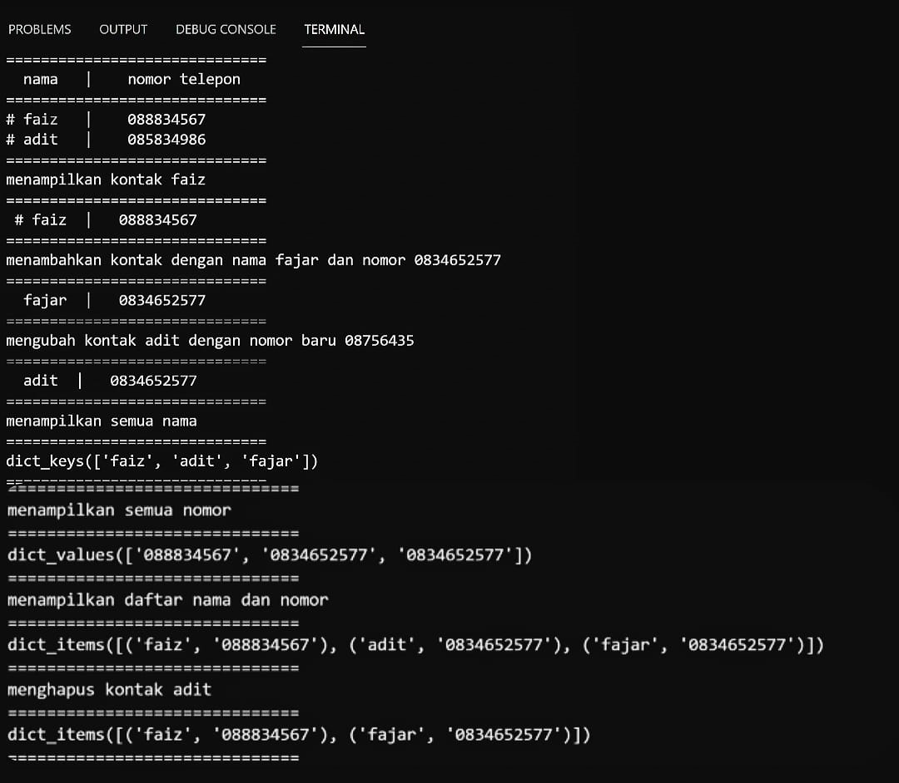
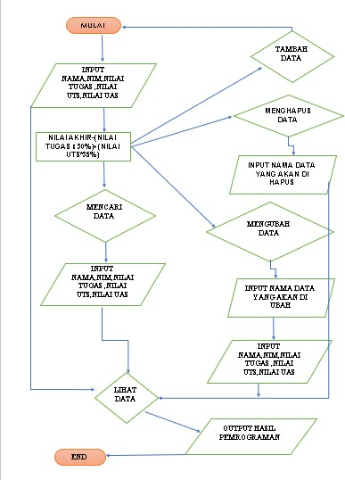
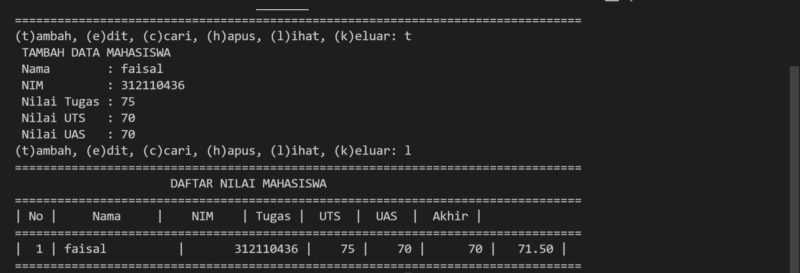
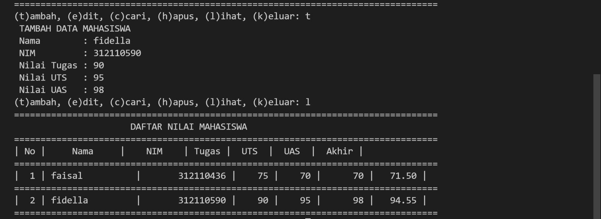

# labs05
## Latihan 1
### Membuat daftar kontak dengan mengguakan dictionary pada pyhton
* Berikut source code program latihan 1 

```python
daftarkontak = {"nama": "nomor telepon"}
kontak = {'faiz': '088834567', 'adit': '085834986'}

print("="*30)
print("  nama   |    nomor telepon  ")
print("="*30)
print("# faiz   |   ", kontak['faiz'])
print("# adit   |   ", kontak['adit'])
print("="*30)

# menampilkan kontak faiz
print("menampilkan kontak faiz")
print("="*30)
print(" # faiz  |  ", kontak['faiz'])
print("="*30)

# menambahkan kontak dengan nama fajar dan nomor 0834652577
print("menambahkan kontak dengan nama fajar dan nomor 0834652577")
kontak['fajar'] = '0834652577'
print("="*30)
print("  fajar  |  ", kontak['fajar'])
print('='*30)

# mengubah kontak adit dengan nomor baru 08756435
print("mengubah kontak adit dengan nomor baru 08756435")
kontak['adit'] = '0834652577'
print("="*30)
print("  adit  |  ", kontak['adit'])
print("="*30)

# menampilkan semua nama
print("menampilkan semua nama")
print("="*30)
print(kontak.keys())
print("="*30)

# menampilkan semua nomor
print("menampilkan semua nomor")
print("="*30)
print(kontak.values())
print("="*30)

# menampilkan semua daftar kontak beserta nomornya
print("menampilkan daftar nama dan nomor")
print("="*30)
print(kontak.items())
print("="*30)

# menghapus kontak adit
print("menghapus kontak adit")
kontak.pop('adit')
print("="*30)
print(kontak.items())
print("="*30)
```
* Berikut ini adalah hasil programnya




## Tugas praktikum
<p> Dibawah ini adalah program sederhana untuk membuat daftar nilai mahasiswa dengan menggunakan kamus, dan menampilkan pilihan menu tambah, ubah, cari, hapus, dan lihat

* Berikut ini adalah source code programnya
```python
a = {}
print("="*80)
print("|      PROGRAM INPUT NILAI MAHASISWA MENGGUNAKAN DICTIONARY      |")
print("="*80)

while True:
    c = input("(t)ambah, (e)dit, (c)cari, (h)apus, (l)ihat, (k)eluar: ")

    if c .lower() == 't':
        print(" TAMBAH DATA MAHASISWA ")
        nama = input(" Nama        : ")
        nim = int(input(" NIM         : "))
        tugas = int(input(" Nilai Tugas : "))
        uts = int(input(" Nilai UTS   : "))
        uas = int(input(" Nilai UAS   : "))
        n_akhir = tugas * 0.30 + uts * 0.35 + uas * 0.35
        a[nama] = nim, tugas, uts, uas, n_akhir

    elif c .lower() == 'e':
        print("| EDIT DATA MAHASISWA |")
        nama = input("Masukkan Nama: ")
        if nama in a.keys():
            nim = input("Masukkan NIM          : ")
            tugas = int(input("Masukkan Nilai Tugas  : "))
            uts = int(input("Masukkan Nilai UTS   : "))
            uas = int(input("Masukkan Nilai UAS    : "))
            n_akhir = tugas * 0.30 + uts * 0.35 + uas * 0.35
            a[nama] = nim, tugas, uts, uas, n_akhir
        else:
            print("Nama{0} Tidak Ada" . format(nama))

    elif c.lower() == 'h':
        print("hapus data")
        nama = input("Masukan Nama : ")
        if nama is a.keys():
            del a[nama]
        else:
            print("Nama{0} Tidak Ada".format(nama))

    elif c.lower() == 'c':
        print("| CARI DATA MAHASISWA |")
        nama = input("Masukan Nama :  ")
        if nama in a.keys():
            print("="*80)
            print("|                  DAFTAR NILAI MAHASISWA                   |")
            print("="*80)
            print("|     Nama     |    NIM    | Tugas |  UTS  |  UAS  |  Akhir |")
            print("="*80)
            print("| {0:15s} | {1:15d} | {2:5d} | {3:5d} | {4:7d} | {5:7.2f} |"
                  .format(nama, nim, tugas, uts, uas, n_akhir))
            print("="*80)
        else:
            print("Nama {0} Tidak Ada ".format(nama))

    elif c.lower() == 'l':
        if a.items():
            print("="*80)
            print("                      DAFTAR NILAI MAHASISWA                    ")
            print("="*80)
            print("| No |     Nama     |    NIM    | Tugas |  UTS  |  UAS  |  Akhir |")
            print("="*80)
            i = 0
            for y in a.items():
                i += 1
                print("| {no:2d} | {0:15s} | {1:15d} | {2:5d} | {3:5d} | {4:7d} | {5:7.2f} |"
                      .format(y[0][:13], y[1][0], y[1][1], y[1][2], y[1][3], y[1][4], no=i))
                print("="*80)
        else:
            print("="*80)
            print("                      DAFTAR NILAI MAHASISWA                    ")
            print("="*80)
            print("| No |     Nama     |    NIM    | Tugas |  UTS  |  UAS  |  Akhir |")
            print("="*80)
            print("|                          TIDAK ADA DATA!                       |")
            print("="*80)

    elif c.lower() == 'k':
        break

    else:
        print("Pilih menu yang tersedia: ")
```
* Berikutflowchartnya




* Penjelasan source code sebagai berikut :
- dibawah ini adalah kamus yang kosong , untuk menampung kamus dengan touple.
```python
a = {}
```
- kode dibawah ini adalah perulangan yang akan berjalan terus menerus, dan akan berhenti jika kode berikut dieksekusi.
```python
while True:
    c = input("(t)ambah, (e)dit, (c)cari, (h)apus, (l)ihat, (k)eluar: ")
```
- kode dibawah ini  adalah untuk sintaks penambahan data, dengan ketentuan jika kita mengetikkan 't' pada keyboard, maka akan melakukan penambahan data dan ditampung ke dalam kamus 'a' yang telah kita buat, dengan nama sebagai kunci, dan yang lainnya sebagai nilai.
```python
if c .lower() == 't':
        print(" TAMBAH DATA MAHASISWA ")
        nama = input(" Nama        : ")
        nim = int(input(" NIM         : "))
        tugas = int(input(" Nilai Tugas : "))
        uts = int(input(" Nilai UTS   : "))
        uas = int(input(" Nilai UAS   : "))
        n_akhir = tugas * 0.30 + uts * 0.35 + uas * 0.35
        a[nama] = nim, tugas, uts, uas, n_akhir
```
- Kode dibawah untuk mengubah sintaksis data, jika mengetikan "e" maka akan melakukan perubahan data, tetapi yang dapat dibah hanya nilai-nilainya saja.
```python
elif c .lower() == 'e':
        print("| EDIT DATA MAHASISWA |")
        nama = input("Masukkan Nama: ")
        if nama in a.keys():
            nim = input("Masukkan NIM          : ")
            tugas = int(input("Masukkan Nilai Tugas  : "))
            uts = int(input("Masukkan Nilai UTS   : "))
            uas = int(input("Masukkan Nilai UAS    : "))
            n_akhir = tugas * 0.30 + uts * 0.35 + uas * 0.35
            a[nama] = nim, tugas, uts, uas, n_akhir
        else:
            print("Nama{0} Tidak Ada" . format(nama))
```
- untuk mencari data yang akan diubah sama seperti cara mengubah data, hanya saja perintah ini digunakan untuk menampilkan data yang di input berdasarkan nama. berikut kode yang digunakan.
```python
    elif c.lower() == 'c':
        print("| CARI DATA MAHASISWA |")
        nama = input("Masukan Nama :  ")
        if nama in a.keys():
            print("="*80)
            print("|                  DAFTAR NILAI MAHASISWA                   |")
            print("="*80)
            print("|     Nama     |    NIM    | Tugas |  UTS  |  UAS  |  Akhir |")
            print("="*80)
            print("| {0:15s} | {1:15d} | {2:5d} | {3:5d} | {4:7d} | {5:7.2f} |"
                  .format(nama, nim, tugas, uts, uas, n_akhir))
            print("="*80)
        else:
            print("Nama {0} Tidak Ada ".format(nama))
```

- Untuk mengghapus data yang dipilih , data yang dihapus adalah data yang dimasukan hearts variabel dimana yang berisi nim , nilai tugas , uts , uas .
```python
    elif c.lower() == 'h':
        print("hapus data")
        nama = input("Masukan Nama : ")
        if nama is a.keys():
            del a[nama]
        else:
            print("Nama{0} Tidak Ada".format(nama))
```

- Berikutnya yaitu Kode yang digunakan untuk menampilkan keseluruhan dari data yang telah di inputkan.
```python
    elif c.lower() == 'l':
        if a.items():
            print("="*80)
            print("                      DAFTAR NILAI MAHASISWA                    ")
            print("="*80)
            print("| No |     Nama     |    NIM    | Tugas |  UTS  |  UAS  |  Akhir |")
            print("="*80)
            i = 0
            for y in a.items():
                i += 1
                print("| {no:2d} | {0:15s} | {1:15d} | {2:5d} | {3:5d} | {4:7d} | {5:7.2f} |"
                      .format(y[0][:13], y[1][0], y[1][1], y[1][2], y[1][3], y[1][4], no=i))
                print("="*80)
```
- Sedangkan kode di bawah adalah untuk sintaks keluar dari program, untuk menghentikan program, dengan ketentuan jika kita mengetikkan 'k' pada keyboard, maka akan keluar dari program tersebut.

```python
    elif c.lower() == 'k':
        break
```
* Berikut hasil program



